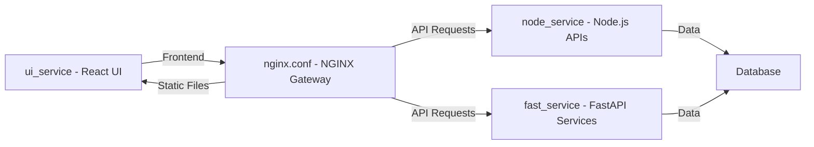

# Health Root Project

## Overview

**Health Root** is a modular, containerized project designed to serve a React UI, APIs, and static files efficiently. It leverages Docker and NGINX for seamless deployment and scalability. The project consists of:

- **React UI**: The frontend interface, located in the `ui_service` directory.
- **Node.js Services**: Backend services for various APIs, located in the `node_service` directory.
- **FastAPI Services**: Additional backend services written in Python, located in the `fast_service` directory.
- **NGINX**: Acts as the static file cache and API gateway for optimized performance.

---

## Prerequisites

Before you begin, ensure your system has the following installed:

- **Docker**: [Install Docker](https://docs.docker.com/get-docker/)
- **Docker Compose**: [Install Docker Compose](https://docs.docker.com/compose/install/)

---

## Project Structure



- **`docker-compose.yml`**: Orchestrates service definitions and interactions.
- **`Dockerfile`**: Defines the build instructions for the FastAPI service container.
- **`ui_service/`**: Contains all files related to the React UI.
- **`node_service/`**: Houses the Node.js application files.
- **`fast_service/`**: Includes the FastAPI backend implementation.
- **`nginx.conf`**: Configures NGINX for caching and API routing.

---

## Installation and Setup

Follow these steps to set up and run the project:

### 1. Clone the Repository

Clone the repository to your local machine:

```bash
git clone git@gitlab.com:health_mate/health_root.git
cd health_root
```

### 2. Build and Deploy Services

Use Docker Compose to build and start the application services:

```bash
docker-compose up --build
```

### 3. Access the Application

- **React UI**: Accessible at `http://localhost:3000`
- **Node.js APIs**: Reachable at `http://localhost:3001`
- **FastAPI Services**: Available at `http://localhost:8001`
- **NGINX Gateway**: Main entry point for the application at `http://localhost`

---

## Key Configuration Notes

- **Docker**: Ensure the Docker daemon is running prior to executing commands.
- **NGINX**: The `nginx.conf` file is preconfigured for:
  - Routing API requests to respective services.
  - Caching static files for performance.

---

## Troubleshooting

### Common Issues

1. **Docker Issues**:
   - Verify Docker and Docker Compose are correctly installed and running.
   - Check service-specific logs using:
     ```bash
     docker-compose logs <service_name>
     ```
     Replace `<service_name>` with the relevant service (e.g., `fast_service`).

2. **Configuration Errors**:
   - Ensure `nginx.conf` is correctly set up for your environment.

### Need Help?

Refer to the project documentation or open an issue in the repository if you encounter additional problems.

---

## Contributing

Contributions to **Health Root** are welcome! Please follow the standard GitLab workflow:

1. Fork the repository.
2. Create a feature branch.
3. Submit a merge request with clear documentation of changes.

---

## License

This project is licensed under [LICENSE NAME]. See the `LICENSE` file for details.

---


